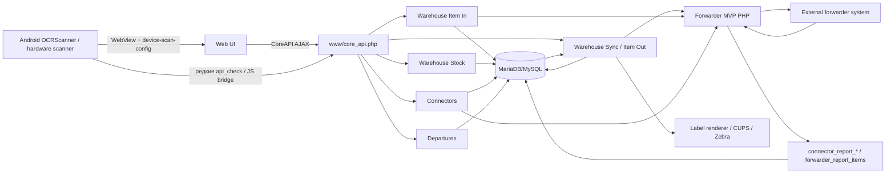

# CargoCells — архитектура системы

**Baseline:** 2026-08-07

## 1. Общая схема



## 2. Границы ответственности

### 2.1 Android APP — `APP/OCRScanner`

APP — это scanner/kiosk клиент вокруг WebView, а не отдельный warehouse backend.

Основные обязанности:

- загрузить серверный `/main` в WebView;
- получить `device-scan-config`, OCR templates и словари из страницы;
- обработать hardware laser scan, CameraX/MLKit barcode/OCR;
- выполнить native flow (`open_scanner`, `set_step`, `web`, `web_if`, `noop` и scan actions);
- заполнить DOM или вызвать разрешённое серверное действие;
- поддерживать device enrollment/login и PHP session в WebView.

**Архитектурное правило:** APP не должен самостоятельно решать, можно ли посылку принять, переместить или отгрузить. Он получает сценарий от Web и окончательное решение от backend.

### 2.2 Web UI

Web выполняет две функции:

1. обычный интерфейс для браузера;
2. источник server-driven scanner flow для APP через `device-scan-config`.

Старый и текущий контракт уже зафиксирован в `DOCS/native_flow_operation.md`: Web остаётся источником сценариев, APP выполняет их нативно, а браузер без APP имеет JS fallback.

### 2.3 CoreAPI — `www/core_api.php`

`core_api.php` — центральный action router. Он:

- проверяет PHP session;
- получает `action`;
- маршрутизирует его в конкретный handler;
- возвращает единый JSON response.

Критичные warehouse-группы:

```text
warehouse_item_in_actions.php     — приёмка
warehouse_item_stock_actions.php  — остаток/карточка/история
warehouse_move.php                — перемещения
warehouse_sync_actions.php        — sync/outbound/label/shipping
warehouse_cells_actions.php       — ячейки и mapping позиций форварда
```

Отдельно:

```text
connector_actions.php             — конфигурация коннекторов
system_tasks_actions/lib.php      — фоновые задачи
 departures_actions.php           — рейсы/контейнеры/UI departures
```

## 3. Основные сущности данных

### `warehouse_item_in`

Временная зона приёмки. Содержит посылки в незавершённой партии до `commit_item_in_batch`.

### `warehouse_item_stock`

Главная локальная карточка физически принятой/известной складу посылки.

Важные группы данных:

- tracking/TUID;
- получатель/страна/форвард;
- вес/габариты;
- `cell_id`;
- `addons_json`;
- признаки происхождения от report (`source_origin`, `connector_id`, `forwarder_report_item_id`, `forwarder_position_code`, `forwarder_synced_at`);
- состояние предрегистрации у форвардера (`forwarder_registration_*`).

### `warehouse_item_out`

Локальная outbound state record. Не является копией внешнего статуса форварда.

Здесь хранятся:

- `stock_item_id`;
- tracking/TUID;
- forwarder/country;
- `status` и `status_message`;
- outbound cell;
- выбранные flight/container;
- подготовленный label payload.

`warehouse_item_out.status` — локальная машина состояний, описанная в `STATUS_MODEL.md`.

### `forwarder_report_items`

Нормализованный слой элементов отчёта форвардера. Используется при импорте данных из внешних report.

### `connector_report_<forwarder>_<country>`

Таблицы «сырого/операционного» report конкретного connector. Например, generic resolver строит имя из forwarder и country.

### `connectors`

Карточка подключения:

- имя и страны;
- base URL;
- credentials/session;
- `operations_json`;
- active/test flags.

### `connectors_addons`

Дополнительный контракт connector:

- `addons_json`;
- legacy `node_mapping_json`;
- `status_targets_json`;
- `report_out_statuses_json`.

Последнее поле — главный data-driven mapping:

```text
внешний report status -> warehouse_item_out.status
```

### Рейсы/контейнеры

Таблицы формируются/резолвятся на основании connector operation, например `connector_*_flight_list` и связанные `*_containers`.

### Аудит и фон

- `warehouse_sync_audit` — бизнес/синхронизационные события;
- `warehouse_sync_trace` — технические stages/policy/decision snapshots;
- `audit_logs` — общий аудит;
- `system_tasks`, `system_task_runs` — scheduler;
- `warehouse_sync_batch_jobs`, `warehouse_sync_batch_job_items` — batch queue.

## 4. Forwarder integration

Рабочее PHP-ядро находится в:

```text
www/scripts/mvp/app/Forwarder/
```

Текущая структура уже содержит отдельные слои:

```text
Config/
DTO/
Http/
Logging/
Orchestrator/
Services/
```

а также CLI entrypoints `run_*.php`.

Контракт endpoint'ов хранится в:

```text
www/scripts/mvp/app/Forwarder/forwarder_endpoints_contract.yaml
```

Целевое направление уже было зафиксировано в существующих документах: общий Core + адаптер конкретной forward-системы + operation resolver. Это направление сохраняется в новом roadmap.

## 5. Background execution

Cron запускает:

```text
www/scripts/cron/system_tasks_runner.php
```

а интервалы конкретных задач хранятся в БД. В текущей документации зафиксированы как минимум:

- batch worker;
- periodic reconcile;
- connector operation jobs.

**Правило:** cron runner должен быть простым scheduler loop. Бизнес-операция должна жить в service/handler, а не внутри cron script.

## 6. Printing

Outbound flow умеет готовить/печатать label. В текущем коде основной production mode — ZPL vector template; также существуют PDF/ZPL fallback paths.

Печать — отдельный side effect. В целевой модели она должна иметь явный результат (`pending/ok/error`) и не быть скрыто смешана с подтверждением отправки у форвардера.

## 7. Источники истины

Нужно различать три независимых состояния:

```text
1. warehouse_item_stock / forwarder_registration_*  — регистрация карточки
2. external report status                           — что говорит форвардер
3. warehouse_item_out.status                        — локальный outbound workflow
```

Смешивание этих трёх понятий — главный источник уже обнаруженных ошибок.

## 8. Архитектурный принцип дальнейшей разработки

Целевая последовательность вызовов:

```text
UI/APP
  -> API handler
     -> domain/service
        -> transition/connector service
           -> DB + audit
           -> external adapter/outbox
```

Не рекомендуется добавлять новые бизнес-условия напрямую в APP, Smarty template, runner или случайный `if ($status === ...)`. Новое правило должно иметь одно место исполнения и тест.
