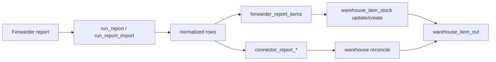

# CargoCells — Forwarder MVP

**Baseline:** 2026-08-07

## 1. Назначение

`www/scripts/mvp/app/Forwarder/` — текущий PHP integration layer между CargoCells и внешней системой форвардера.

Он уже перестал быть просто набором одноразовых скриптов: в каталоге присутствуют общие слои `Config`, `DTO`, `Http`, `Logging`, `Orchestrator`, `Services`, а CLI runners выступают entrypoints для backend/background операций.

Цель дальнейшего развития — сохранить рабочие runners, но постепенно сделать их тонкими оболочками над общим Forwarder Core и connector adapter.

---

## 2. Основные каталоги

```text
Forwarder/
  Config/          — config/connector resolution
  DTO/             — структуры данных
  Http/            — HTTP/session layer
  Logging/         — technical logs
  Orchestrator/    — orchestration
  Services/        — business operations
  README/          — исторические планы/заметки
  run_*.php        — CLI entrypoints
  sync_kernel.php  — sync kernels
  forwarder_endpoints_contract.yaml
```

Отдельные системы уже могут иметь специализированные каталоги, например CAMEX_AZ. Это подтверждает необходимость adapter boundary, чтобы не плодить копии общего кода.

---

## 3. Endpoint contract

Канонический технический контракт внешних endpoint'ов:

```text
www/scripts/mvp/app/Forwarder/forwarder_endpoints_contract.yaml
```

Он должен содержать для каждой операции:

- HTTP method/path;
- обязательные/опциональные аргументы;
- CSRF/session requirements;
- response type;
- поля, которые нужно парсить;
- критерий успеха;
- verify step, если операция изменяет внешнее состояние.

**Правило:** новый runner без записи в endpoint contract считается временным/exploratory.

---

## 4. Карта runners

### Посылки

| Runner | Назначение |
|---|---|
| `run_add_package.php` | создать/предзарегистрировать посылку у форвардера |
| `run_package_details.php` | получить детали посылки |
| `run_search_forward.php` | поиск во внешней системе |
| `run_report_single.php` | точечная проверка tracking |
| `run_add_package_to_container.php` | добавить посылку в container/position |

### Reports

| Runner | Назначение |
|---|---|
| `run_report.php` | report flow |
| `run_report_import.php` | получить и нормализовать all-packages report |
| `run_report_bot.php` | автоматизированный report сценарий |
| `run_report_single.php` | single-package check |

### Flights

| Runner | Назначение |
|---|---|
| `run_flight_list.php` | список/синхронизация рейсов |
| `run_add_flight.php` | создать рейс |
| `run_edit_flight.php` | изменить рейс |
| `run_delete_flight.php` | удалить рейс |
| `run_close_flight.php` | закрыть рейс/экспериментальный finalization path |

### Containers

| Runner | Назначение |
|---|---|
| `run_list_container_to_flight.php` | получить контейнеры рейса |
| `run_add_container_to_flight.php` | создать/привязать контейнер |
| `run_del_container_from_flight.php` | удалить контейнер |
| `run_list_container.php` | получить посылки контейнера |
| `run_sync_flight_containers.php` | синхронизировать локальный container snapshot |
| `run_add_package_to_container.php` | добавить tracking в container |

---

## 5. Авторизация/session

Целевая архитектура уже сформулирована в существующем `forwarder_php_migration_plan.md`:

```text
ForwarderHttpClient
  + SessionManager
  + ForwarderSessionClient
  + Service
```

Общие вещи — login, cookies, CSRF, timeout, retry и logging — не должны копироваться по runners.

Credentials берутся из connector configuration. Их нельзя дублировать в operation JSON, log или audit payload.

---

## 6. Report pipeline

Общий смысл:



Нормализованный report должен сохранять внешний status как внешний факт. Преобразование в локальный outbound state выполняется отдельно через connector mapping.

---

## 7. Connector-specific status mapping

Runtime config:

```text
connectors_addons.report_out_statuses_json
```

решает:

```text
external report status -> warehouse_item_out.status
```

Именно это позволяет одной системе использовать `Declared`, другой — другое название, не меняя warehouse core.

Legacy `status_targets_json` остаётся совместимым routing mechanism, но новые state mappings лучше хранить в `report_out_statuses_json`.

---

## 8. Flights/containers snapshot

`sync_kernel.php` синхронизирует контейнеры внешнего рейса в локальные таблицы, использует connector/flight identifiers и защищается от опасного массового deactivate при неожиданно пустом ответе.

Локальная копия нужна для:

- списка open flights;
- выбора контейнера в outbound UI/APP;
- сравнения количества мест/веса;
- диагностики рассинхронизации.

---

## 9. Целевая adapter architecture

Существующий `connectors_forwarder_refactor_plan.md` предлагает правильное направление. В актуализированном виде:

```text
ForwarderCore/
  Http/
  Session/
  DTO/
  Logging/
  Contracts/
  Services/

Connectors/
  ASER/
    Adapter.php
    OperationMap.php
    FieldMap.php
  CAMEX_AZ/
    Adapter.php
    OperationMap.php
    FieldMap.php

runners/
  run_operation.php
```

Но миграция должна идти **после стабилизации warehouse status model**, иначе мы одновременно изменим и transport layer, и бизнес state machine.

---

## 10. Требования к любой mutating operation

Операции `create/update/delete/add-to-container/close` должны иметь:

1. deterministic request;
2. timeout;
3. idempotency strategy;
4. explicit success criterion;
5. verify/post-check, если внешний API это позволяет;
6. structured result;
7. correlation ID;
8. masked credentials;
9. retry classification: retryable / permanent;
10. audit link к local item/job.

---

## 11. Особое правило для outbound

`run_add_package_to_container.php` — внешний side effect. Локальный `sended` не должен считаться подтверждённым только потому, что background process был запущен.

Целевая схема:

```text
to_send
  -> send_pending_external
      -> external confirmed
          -> sended
      -> retryable error
          -> send_pending_external
      -> permanent error
          -> send_error
```

Если новый статус добавлять пока слишком рискованно, можно сначала реализовать outbox/job с `external_sync_status` отдельно от `warehouse_item_out.status`.
