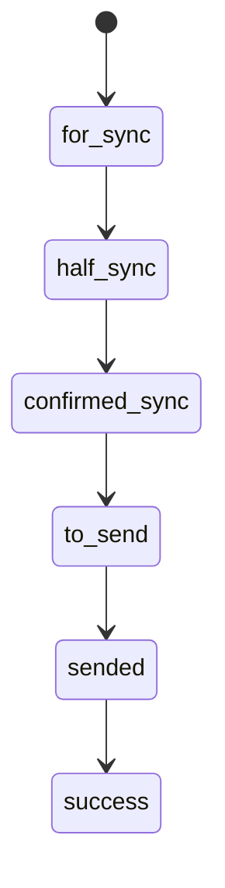

# CargoCells — модель статусов

**Baseline:** 2026-08-07

## 1. Главное правило

Нельзя смешивать:

1. **статус регистрации карточки у форварда** (`warehouse_item_stock.forwarder_registration_status`);
2. **внешний status из report** (`Declared`, `Not declared`, и т.п.);
3. **локальный outbound state** (`warehouse_item_out.status`).

Они отвечают на разные вопросы.

---

## 2. `warehouse_item_out.status`

| Status | Смысл | Можно отгружать сканером? |
|---|---|---:|
| `for_sync` | локальная запись существует, требуется синхронизация/определение состояния | нет |
| `half_sync` | запрос/регистрация выполнены частично; ждём подтверждения/report | нет |
| `confirmed_sync` | регистрация/синхронизация подтверждена, но outbound readiness ещё не подтверждена | нет |
| `to_send` | посылка разрешена для outbound; готова к выбору рейса/контейнера | да |
| `sended` | локально подтверждено помещение/отправка в outbound container | повторное подтверждение разрешено текущим backend для идемпотентного/retry сценария |
| `success` | присутствует в модели и mapping, но точное бизнес-условие terminal success пока не формализовано | нет/не определено |
| `error` | операция завершилась ошибкой; причина находится в `status_message`/audit | зависит от recovery policy |

`success` нельзя считать надёжно определённым terminal state до отдельного решения, что именно его устанавливает: закрытие контейнера, закрытие рейса, подтверждение forwarder report или другой факт.

---

## 3. Текущий временный rank

В runtime reconcile сейчас используется:

```php
$rank = [
    'for_sync'       => 10,
    'half_sync'      => 20,
    'error'          => 20,
    'confirmed_sync' => 25,
    'to_send'        => 30,
    'sended'         => 50,
    'success'        => 60,
];
```

Этот rank — **механизм защиты от случайного отката**, а не полноценная state machine.

Ключевой исправленный инвариант:

```text
confirmed_sync (25) -> to_send (30)
```

является движением вперёд.

---

## 4. Целевая state machine

Числовой rank должен быть заменён на явный набор разрешённых переходов.

### Базовый happy path



### Разрешённые shortcut-переходы

Report/import может дать больше информации, чем локальный pipeline, поэтому допустимы:

```text
for_sync   -> confirmed_sync
for_sync   -> to_send
half_sync  -> to_send
```

Главный пример: импортированная из report уже `Declared` посылка может сразу стать `to_send`.

### Ошибка — не нормальная ступень progression

`error` логически лучше считать **состоянием операции/инцидента**, а не «ступенью 20» между `for_sync` и `confirmed_sync`.

Проблема текущего rank:

```text
confirmed_sync=25
error=20
```

означает, что поздний error-report может быть отвергнут как downgrade. Это может защищать от плохого внешнего report, но сейчас это не оформлено как осознанное business rule.

Целевое решение:

- либо отдельное поле `sync_health/error_code/error_at`;
- либо explicit transition policy по типу ошибки;
- но не числовое сравнение всех состояний одной шкалой.

---

## 5. Внешние статусы report

Строки внешней системы **не должны hard-code'иться как универсальные warehouse statuses**.

Основной контракт:

```text
connectors_addons.report_out_statuses_json
```

Пример:

```json
{
  "Not declared": "confirmed_sync",
  "Declared": "to_send"
}
```

Фактическая карта — runtime-конфигурация конкретного connector/country и должна быть проверена при runtime-аудите.

Legacy routing:

```text
connectors_addons.status_targets_json
```

может связывать внешний status с target table. Этот механизм нужно сохранить для совместимости, но не расширять без необходимости.

---

## 6. Регистрация у форварда

`warehouse_item_stock.forwarder_registration_status` имеет другую семантику.

Наблюдаемые значения включают:

```text
ok
validation_error
connector_error
forwarder_error
```

`ok` отвечает на вопрос:

> «Удалось ли создать/найти карточку посылки у forwarder?»

Он **не отвечает** на вопрос:

> «Можно ли уже отгружать посылку?»

Для второго вопроса нужен `warehouse_item_out.status = to_send`.

---

## 7. Кто имеет право менять outbound state

Целевое правило:

| Источник | Какие переходы |
|---|---|
| stock/backfill | создать `for_sync` |
| report resolver/reconcile | `for_sync/half_sync/confirmed_sync -> ...` до `to_send` |
| declared report import | создать/перевести в `to_send` по явному mapping |
| outbound confirm service | `to_send -> sended` |
| finalization service | `sended -> success` после формализации критерия |
| generic UI/APP | **не меняет status напрямую** |

---

## 8. Что запрещаем после перехода на explicit transition service

Следующие конструкции должны исчезать из бизнес-кода вне единого transition service:

```php
UPDATE warehouse_item_out SET status = '...'
```

и:

```php
if ($status === '...') { ... }
```

если это определяет допустимость state transition.

Вместо этого:

```text
WarehouseOutTransitionService::transition(
    item,
    from,
    to,
    reason,
    source,
    correlationId
)
```

Service должен:

1. проверить переход;
2. выполнить update атомарно;
3. записать audit;
4. вернуть structured result;
5. быть идемпотентным.

---

## 9. Минимальные regression tests модели

Обязательные тесты перед рефакторингом:

1. `Not declared -> confirmed_sync`.
2. следующий `Declared -> to_send`.
3. `to_send` не откатывается в `confirmed_sync` из-за старого report.
4. новая report-посылка с `Declared` сразу получает `to_send`.
5. `to_send -> sended` только через outbound confirm.
6. повторный confirm `sended` не создаёт неконтролируемый дубль.
7. неизвестный report status не переводит автоматически в `to_send`.
8. error/retry policy проверяется отдельно от progression rank.
