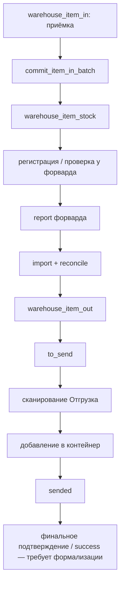

# CargoCells — жизненный цикл посылки

**Baseline:** 2026-08-07

Этот документ описывает бизнес-поток посылки, а не только последовательность экранов.

## 1. Главный pipeline



Не каждая посылка обязана пройти каждый промежуточный статус. Посылка, впервые обнаруженная в report форвардера и уже имеющая `Declared`, может войти в локальный pipeline сразу как `warehouse_item_stock + warehouse_item_out:to_send`.

---

## 2. Сценарий A — обычная локальная приёмка

### Шаг A1. Создание/сканирование позиции

APP/Web работает с `warehouse_item_in`.

Здесь собираются:

- tracking/TUID;
- получатель;
- forwarder/country;
- ячейка;
- вес/габариты;
- фотографии/OCR;
- `addons_json`.

До commit это ещё не основная складская карточка.

### Шаг A2. `commit_item_in_batch`

Handler:

```text
www/api/warehouse/warehouse_item_in_actions.php
```

Фактическая последовательность:

1. выбрать незакоммиченные строки партии;
2. `INSERT ... SELECT` из `warehouse_item_in` в `warehouse_item_stock`;
3. пометить строки `warehouse_item_in.committed = 1`;
4. найти созданные stock items;
5. проверить обязательные данные;
6. определить connector;
7. выполнить предрегистрацию у forwarder;
8. сохранить `forwarder_registration_status/message/response`;
9. записать audit.

Для generic Forwarder используется `run_add_package.php`. Для отдельных систем уже существуют специальные ветки, например CAMEX_AZ.

### Шаг A3. Важное разделение статусов

Успешный `forwarder_registration_status = ok` **не означает автоматически `to_send`**.

Это означает только, что карточка зарегистрирована/известна внешней системе. Готовность к outbound определяется report + mapping.

---

## 3. Сценарий B — посылка пришла из report форвардера

Report import может создать локальную stock-карточку, даже если оператор ранее не проводил её через `warehouse_item_in`.

`warehouse_forwarder_import_report_items()`:

1. upsert нормализованной строки в `forwarder_report_items`;
2. ищет существующий `warehouse_item_stock` по connector + tracking, затем fallback по tracking;
3. обновляет существующую карточку или создаёт новую;
4. ставит признаки:
   - `source_origin = forwarder_report` для созданной из report карточки;
   - `connector_id`;
   - `forwarder_report_item_id`;
   - `forwarder_position_code`;
   - `forwarder_synced_at`;
5. пытается сопоставить позицию форвардера с локальной ячейкой;
6. вызывает outbound sync.

### Если внешний статус уже Declared

`warehouse_forwarder_status_is_declared()` сейчас принимает как declared:

```text
Declared
Declared duty paid
Legal entity
```

Если локальной outbound-записи ещё нет, helper создаёт `warehouse_item_out` со статусом:

```text
to_send
```

Это важный бизнес-инвариант: **посылка, пришедшая от форвардера уже задекларированной, не должна требовать повторной локальной регистрации только ради возможности пройти outbound pipeline.**

### Если outbound-запись уже существует

Helper не переписывает произвольный существующий state. Если state не `to_send`, дальнейший переход должен выполнить reconcile. Это скрытая зависимость, отмеченная в audit.

---

## 4. Report -> local outbound state

Внешний report status и локальный `warehouse_item_out.status` — разные сущности.

Разрешение статуса выполняется в таком порядке:

1. `connectors_addons.report_out_statuses_json` — явный mapping внешнего статуса в локальный status;
2. `status_targets_json` — legacy/табличный routing;
3. ограниченный fallback для error/final report statuses;
4. без явного маршрута система не должна самовольно переводить посылку в `to_send`.

Пример ожидаемой логики для connector, где report использует такие строки:

```json
{
  "Not declared": "confirmed_sync",
  "Declared": "to_send"
}
```

Это **пример бизнес-mapping**, а не hard-code: фактические значения должны проверяться в production `connectors_addons`.

---

## 5. Reconcile

Action:

```text
warehouse_sync_reconcile
```

делает:

```text
warehouse_sync_out_backfill_from_stock()
        +
warehouse_sync_reconcile_half_sync()
```

### Backfill

Создаёт отсутствующие `warehouse_item_out` для stock items, у которых есть connector routing.

### Reconcile

Для каждой выбранной outbound-записи:

1. определяет tracking/forwarder/country;
2. ищет последнюю report row;
3. преобразует внешний status в local next status;
4. проверяет, что переход не считается downgrade;
5. обновляет `warehouse_item_out`;
6. пишет `warehouse_sync_audit`.

Reconcile должен быть **идемпотентным**: повторный запуск при тех же исходных данных не должен менять состояние или создавать дублирующие transition events.

---

## 6. Сценарий C — ручная/повторная регистрация stock item

Action:

```text
warehouse_sync_item
```

использует:

```text
run_add_package.php
run_report_single.php
```

Последовательность:

1. выбрать stock item;
2. определить active connector;
3. проверить required fields;
4. собрать payload;
5. отправить регистрацию;
6. проверить результат через single report;
7. записать audit/trace;
8. установить промежуточный outbound status.

На текущем коде успешный manual sync сохраняет `half_sync`, после чего report/reconcile должен определить дальнейшее состояние.

---

## 7. Сценарий D — отгрузка сканером

### D1. Поиск

APP/Web вызывает:

```text
warehouse_item_out_lookup
```

Поиск идёт по tracking/TUID/parcel uid. Если есть несколько совпадений, `to_send` имеет приоритет в ordering.

### D2. Проверка возможности отгрузки

Backend `warehouse_item_out_confirm_send` разрешает подтверждение только для:

```text
to_send
sended
```

`confirmed_sync` намеренно недостаточен: это ещё не «готово к отгрузке».

### D3. Выбор рейса/контейнера

Список доступных контейнеров собирается из open flight records connector-а. Для подтверждения требуются flight/container identifiers.

### D4. Forwarder action

Основной PHP runner:

```text
www/scripts/mvp/app/Forwarder/run_add_package_to_container.php
```

Его задача — добавить tracking в выбранную position/container внешней системы и, где включено, проверить результат.

### D5. Локальное состояние

После подтверждения outbound local state становится:

```text
sended
```

Также сохраняются:

- `shipment_cell`;
- `shipped_flight_no`;
- `shipped_container_name`;
- `status_message`;
- label payload/status.

### D6. Label

Label может быть подготовлен заранее либо сформирован в fallback path. Production path сейчас ориентирован на ZPL/CUPS.

**Критичный audit note:** fast path сейчас может сначала выполнить локальную печать/обновление, а external add-to-container запустить в фоне. Это создаёт окно расхождения «локально sended, у форвардера не подтверждено». Исправление есть в roadmap.

---

## 8. Рейсы и контейнеры

Forwarder MVP поддерживает как минимум:

- список рейсов;
- добавление/редактирование/удаление рейса;
- список контейнеров рейса;
- создание/удаление контейнера;
- список посылок контейнера;
- добавление посылки в контейнер;
- синхронизацию flight/container snapshot.

Локальные данные рейсов используются не только для UI, но и для выбора допустимого outbound target.

---

## 9. История одной посылки должна собираться из нескольких источников

Для диагностики нельзя смотреть только на `warehouse_item_out.status`.

Минимальный trace:

```text
warehouse_item_in
  -> warehouse_item_stock
  -> warehouse_item_stock.forwarder_registration_*
  -> forwarder_report_items / connector_report_*
  -> warehouse_sync_audit
  -> warehouse_sync_trace
  -> warehouse_item_out
  -> flight/container snapshot
  -> print result
```

Целевая диагностика должна показывать эту цепочку одним timeline по `stock_item_id + tracking + connector_id`.
